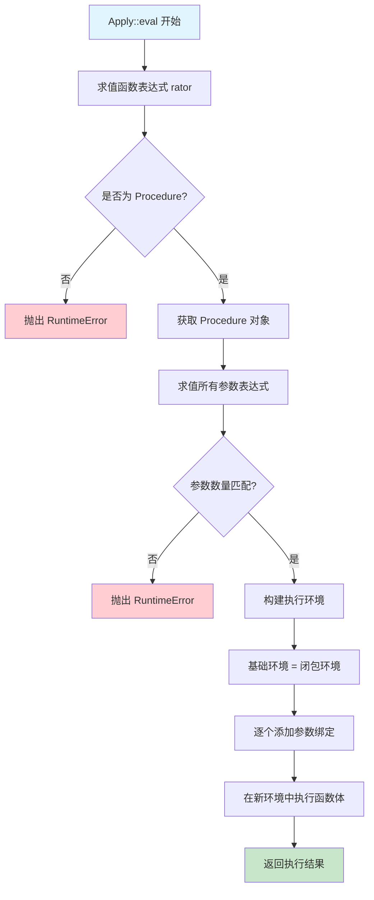

# 🚀 Apply 函数与闭包结合机制详解

本文档深入分析 Scheme 解释器中 `Apply` 函数与闭包（Closure）的结合机制，展示函数调用的完整执行过程。

## 📋 Apply 核心概念

### Apply 结构定义

```cpp
struct Apply : ExprBase {
    Expr rator;                    ///< 函数表达式（操作符）
    std::vector<Expr> rand;        ///< 参数表达式列表（操作数）
    Apply(const Expr &, const std::vector<Expr> &);
    virtual Value eval(Assoc &) override;
};
```

`Apply` 表示函数调用表达式，对应 Scheme 中的 `(function arg1 arg2 ...)` 语法：
- **`rator`**（operator）：要调用的函数表达式
- **`rand`**（operands）：传递给函数的参数表达式列表

## 🔧 Apply::eval 完整执行流程

### 核心代码分析

```cpp
Value Apply::eval(Assoc &e) {
    // 第一阶段：求值函数表达式
    Value mid_fun = rator->eval(e);
    if (mid_fun->v_type != V_PROC) {
        throw RuntimeError("Attempt to apply a non-procedure");
    }

    Procedure* clos_ptr = dynamic_cast<Procedure*>(mid_fun.get());
    
    // 第二阶段：求值参数表达式
    std::vector<Value> args;
    for (int i = 0; i < rand.size(); i++) {
        args.push_back(rand[i]->eval(e));
    }

    // 第三阶段：参数数量验证
    if (args.size() != clos_ptr->parameters.size()) {
        throw RuntimeError("Wrong number of arguments");
    }

    // 第四阶段：构建执行环境
    Assoc param_env = clos_ptr->env;
    for (int i = 0; i < clos_ptr->parameters.size(); i++) {
        param_env = extend(clos_ptr->parameters[i], args[i], param_env);
    }

    // 第五阶段：执行函数体
    return clos_ptr->e->eval(param_env);
}
```

## 🔍 五阶段执行机制详解

### 阶段 1：函数表达式求值

```cpp
Value mid_fun = rator->eval(e);
if (mid_fun->v_type != V_PROC) {
    throw RuntimeError("Attempt to apply a non-procedure");
}
```

**功能**：将函数表达式转换为可调用的 `Procedure` 对象

**示例场景**：
```scheme
;; 场景1：直接函数调用
((lambda (x) (* x x)) 5)
;; rator = Lambda表达式，求值后得到Procedure对象

;; 场景2：变量引用函数  
(define square (lambda (x) (* x x)))
(square 5)
;; rator = Var("square")，求值后从环境中获取Procedure对象

;; 场景3：高阶函数返回
(define (make-multiplier n) (lambda (x) (* x n)))
((make-multiplier 3) 4)
;; rator = Apply表达式，求值后得到新的Procedure对象

;; 场景4：原语函数
(+ 1 2 3)
;; rator = Var("+")，求值时动态创建Procedure对象包装原语
```

**处理逻辑**：
- **Lambda表达式**：直接创建闭包对象
- **变量引用**：从环境中查找已定义的函数
- **原语函数**：动态包装为 `Procedure` 对象
- **复合表达式**：递归求值直到得到函数对象

### 阶段 2：参数表达式求值

```cpp
std::vector<Value> args;
for (int i = 0; i < rand.size(); i++) {
    args.push_back(rand[i]->eval(e));
}
```

**功能**：将所有参数表达式转换为值对象

**求值特点**：
- **从左到右**：按参数列表顺序依次求值
- **当前环境**：在调用点的环境 `e` 中求值参数
- **完全求值**：所有参数在函数调用前完全求值（严格求值策略）

**示例分析**：
```scheme
;; 示例：(square (+ 2 3))
;; 参数求值过程：
;; 1. rand[0] = Plus(Fixnum(2), Fixnum(3))
;; 2. args[0] = Plus::eval(e) = IntegerV(5)
;; 3. 然后调用 square 函数，传入 5

;; 复杂示例：((lambda (f x) (f x)) square (+ 1 4))
;; 参数求值过程：
;; 1. args[0] = square函数对象
;; 2. args[1] = IntegerV(5)
;; 3. 调用lambda，f绑定到square，x绑定到5
```

### 阶段 3：参数数量验证

```cpp
if (args.size() != clos_ptr->parameters.size()) {
    throw RuntimeError("Wrong number of arguments");
}
```

**功能**：确保实际参数与形式参数数量匹配

**验证逻辑**：
- **精确匹配**：参数数量必须完全相等
- **错误处理**：不匹配时抛出运行时错误
- **类型安全**：防止访问不存在的参数

**错误示例**：
```scheme
;; 错误：参数过多
((lambda (x) x) 1 2 3)  ;; RuntimeError: Wrong number of arguments

;; 错误：参数过少  
((lambda (x y) (+ x y)) 1)  ;; RuntimeError: Wrong number of arguments

;; 正确：参数匹配
((lambda (x y) (+ x y)) 1 2)  ;; 正常执行
```

### 阶段 4：构建执行环境（关键闭包机制）

```cpp
Assoc param_env = clos_ptr->env;
for (int i = 0; i < clos_ptr->parameters.size(); i++) {
    param_env = extend(clos_ptr->parameters[i], args[i], param_env);
}
```

**功能**：在闭包环境基础上添加参数绑定

**环境构建策略**：
1. **基础环境**：从闭包的 `env` 开始（函数定义时的环境）
2. **参数绑定**：逐个添加参数名到参数值的绑定
3. **环境扩展**：使用 `extend` 函数创建新的环境层

**环境层次结构**：
```
执行环境层次（由内到外）：
┌─────────────────────────┐
│ 参数绑定层               │ ← extend(param_name, arg_value, closure_env)
│ param1 = arg1           │
│ param2 = arg2           │ 
│ ...                     │
├─────────────────────────┤
│ 闭包捕获环境             │ ← clos_ptr->env (函数定义时的环境)
│ captured_var1 = value1  │
│ captured_var2 = value2  │
├─────────────────────────┤
│ 外层环境链               │
│ ...                     │
└─────────────────────────┘
```

### 阶段 5：函数体执行

```cpp
return clos_ptr->e->eval(param_env);
```

**功能**：在构建好的环境中执行函数体表达式

**执行特点**：
- **新环境**：在 `param_env` 中执行，包含参数绑定和闭包环境
- **表达式求值**：递归调用表达式求值系统
- **返回值**：函数体表达式的求值结果即为函数调用结果

## 🔗 Apply 与闭包结合的核心优势

### 1. 完整的词法作用域支持

```scheme
;; 示例：嵌套作用域
(define (outer x)
  (define (inner y)
    (+ x y))  ;; 可以访问外层的 x
  inner)

(define add5 (outer 5))
(add5 3)  ;; 8
```

**执行分析**：
1. **创建 `outer` 闭包**：捕获全局环境
2. **调用 `(outer 5)`**：
   - 在闭包环境基础上添加 `x = 5`
   - 定义 `inner` 时捕获包含 `x = 5` 的环境
3. **调用 `(add5 3)`**：
   - `add5` 是 `inner` 闭包，环境中包含 `x = 5`
   - 添加参数 `y = 3`
   - 执行 `(+ x y)` 得到 `8`

### 2. 动态函数调用支持

```scheme
;; 示例：函数作为一等公民
(define (apply-twice f x)
  (f (f x)))

(define square (lambda (x) (* x x)))
(apply-twice square 2)  ;; 256, 即 ((2^2)^2)
```

**执行分析**：
1. **第一次Apply**：`(apply-twice square 2)`
   - `f` 绑定到 `square` 闭包
   - `x` 绑定到 `IntegerV(2)`
2. **第二次Apply**：内层的 `(f x)`
   - 调用 `square(2)` 得到 `4`
3. **第三次Apply**：外层的 `f (...)`
   - 调用 `square(4)` 得到 `16`

### 3. 高阶函数与闭包生成

```scheme
;; 示例：闭包工厂
(define (make-counter)
  (define count 0)
  (lambda ()
    (set! count (+ count 1))
    count))

(define counter1 (make-counter))
(define counter2 (make-counter))
(counter1)  ;; 1
(counter1)  ;; 2  
(counter2)  ;; 1
```

**执行分析**：
- **每次调用 `make-counter`**：创建独立的环境包含 `count = 0`
- **返回的lambda**：捕获各自独立的 `count` 变量
- **调用计数器**：在各自的闭包环境中修改 `count`

## 📊 Apply 执行流程图



## 🎯 复杂示例分析

### 示例 1：递归函数调用

```scheme
(define (factorial n)
  (if (<= n 1)
      1
      (* n (factorial (- n 1)))))

(factorial 4)
```

**调用栈分析**：
```
Apply栈层次（最新调用在顶部）：
┌─────────────────────────────┐
│ factorial(1): env={n=1}     │ → 返回 1
├─────────────────────────────┤  
│ factorial(2): env={n=2}     │ → 返回 2*1=2
├─────────────────────────────┤
│ factorial(3): env={n=3}     │ → 返回 3*2=6  
├─────────────────────────────┤
│ factorial(4): env={n=4}     │ → 返回 4*6=24
└─────────────────────────────┘
```

**每次Apply执行**：
1. **函数求值**：`factorial` 变量引用同一个闭包
2. **参数求值**：递减的数值
3. **环境构建**：每次调用独立的 `n` 绑定
4. **递归调用**：在条件分支中再次触发Apply

### 示例 2：高阶函数组合

```scheme
(define (compose f g)
  (lambda (x) (f (g x))))

(define (add1 x) (+ x 1))
(define (mul2 x) (* x 2))
(define add1-then-mul2 (compose mul2 add1))

(add1-then-mul2 3)  ;; (3+1)*2 = 8
```

**执行追踪**：
1. **创建compose闭包**：捕获全局环境
2. **调用compose**：
   - `f` 绑定到 `mul2` 闭包
   - `g` 绑定到 `add1` 闭包
   - 返回新闭包，捕获包含 `f` 和 `g` 的环境
3. **调用组合函数**：
   - `x` 绑定到 `3`
   - 执行 `(g x)`：调用 `add1(3)` 得到 `4`
   - 执行 `(f ...)`：调用 `mul2(4)` 得到 `8`

### 示例 3：闭包状态修改

```scheme
(define (make-account balance)
  (lambda (amount)
    (set! balance (+ balance amount))
    balance))

(define account (make-account 100))
(account 50)   ;; 150
(account -30)  ;; 120
```

**状态变化追踪**：
1. **创建account闭包**：环境包含 `balance = 100`
2. **第一次调用**：
   - `amount` 绑定到 `50`
   - `set!` 修改闭包环境中的 `balance` 为 `150`
   - 返回 `150`
3. **第二次调用**：
   - `amount` 绑定到 `-30`
   - `set!` 修改已存在的 `balance` 为 `120`
   - 返回 `120`

## 🔧 错误处理机制

### 1. 类型错误检测

```cpp
if (mid_fun->v_type != V_PROC) {
    throw RuntimeError("Attempt to apply a non-procedure");
}
```

**触发场景**：
```scheme
(1 2 3)        ;; 试图调用数字
("hello" 42)   ;; 试图调用字符串  
(#t #f)        ;; 试图调用布尔值
```

### 2. 参数数量验证

```cpp
if (args.size() != clos_ptr->parameters.size()) {
    throw RuntimeError("Wrong number of arguments");
}
```

**触发场景**：
```scheme
((lambda (x y) (+ x y)) 1)      ;; 参数不足
((lambda () 42) 1 2)            ;; 参数过多
```

### 3. 运行时错误传播

函数体执行中的错误会自动传播：
```scheme
(define (divide x y)
  (/ x y))

(divide 1 0)  ;; RuntimeError: Division by zero
```

## 💡 设计模式与最佳实践

### 1. 函数式编程模式

```scheme
;; 映射模式
(define (map f lst)
  (if (null? lst)
      '()
      (cons (f (car lst)) 
            (map f (cdr lst)))))

;; 折叠模式  
(define (fold f init lst)
  (if (null? lst)
      init
      (fold f (f init (car lst)) (cdr lst))))
```

### 2. 回调和事件处理

```scheme
;; 事件监听器模式
(define (on-click handler)
  (lambda (event)
    (handler event)))

;; 使用回调
(define button-handler
  (on-click (lambda (evt) (display "Button clicked!"))))
```

### 3. 偏函数应用

```scheme
;; 偏应用工具
(define (partial f . args)
  (lambda more-args
    (apply f (append args more-args))))

;; 创建专用函数
(define add10 (partial + 10))
(add10 5)  ;; 15
```

## 🚀 性能优化考虑

### 1. 环境查找优化

**当前实现**：O(n) 链表查找
```cpp
// 环境链遍历查找变量
Value find(const std::string &x, Assoc &env) {
    // 线性查找实现
}
```

**可能优化**：
- **哈希表环境**：O(1) 变量查找
- **静态分析**：编译时确定变量位置
- **环境压缩**：移除未使用的绑定

### 2. 闭包共享优化

**当前实现**：智能指针自动管理
```cpp
std::shared_ptr<ValueBase> ptr;
std::shared_ptr<AssocList> ptr;
```

**优化策略**：
- **环境共享**：相同作用域的多个闭包共享环境
- **延迟复制**：写时复制（Copy-on-Write）机制
- **垃圾回收**：定期清理无用环境链

### 3. 调用栈优化

**尾递归优化**：
```scheme
;; 可优化为循环的尾递归
(define (factorial-tail n acc)
  (if (<= n 1) 
      acc
      (factorial-tail (- n 1) (* n acc))))
```

## 📈 扩展功能支持

### 1. 可变参数函数

```scheme
;; 支持rest参数（未来扩展）
(define (variadic-func x . rest)
  (cons x rest))
```

### 2. 关键字参数

```scheme
;; 命名参数支持（未来扩展）
(define (make-point #:x x #:y y)
  (list x y))
```

### 3. 默认参数

```scheme
;; 默认参数值（未来扩展）
(define (greet name (greeting "Hello"))
  (string-append greeting ", " name))
```

## 🎯 总结

Apply 函数与闭包的结合是 Scheme 解释器函数调用机制的核心，它实现了：

### ✅ 核心功能
1. **完整的函数调用语义**：支持任意复杂的函数表达式
2. **严格的参数求值**：保证函数调用前参数完全求值
3. **词法作用域支持**：通过闭包环境实现变量捕获
4. **类型安全检查**：运行时验证函数类型和参数匹配
5. **错误处理机制**：提供清晰的错误信息

### ✅ 高级特性
1. **高阶函数支持**：函数可以作为参数和返回值
2. **递归调用支持**：通过环境独立性支持深度递归
3. **状态封装能力**：闭包可以维护私有状态
4. **动态调用能力**：运行时确定调用目标

### ✅ 设计优势
1. **统一抽象**：原语函数和用户函数使用相同调用机制
2. **环境隔离**：每次调用创建独立的执行环境
3. **内存安全**：智能指针自动管理内存生命周期
4. **扩展性强**：支持各种函数式编程模式

这种设计使得 Scheme 解释器具备了现代函数式编程语言的核心能力，为复杂的计算抽象提供了坚实的基础。
